# 🎓 MOEISPEL–SolusiBestariGuru

**Userscript Pintar untuk Semakan dan Statistik Kehadiran, Analisis Profil Murid dan Penyediaan Senarai Nama Murid di Sistem MOEISPEL KPM**

---

## 🎯 Tentang Projek

**MOEISPEL–SolusiBestariGuru** ialah userscript inovatif yang dirancang khusus untuk memudahkan guru-guru di Malaysia dalam penggunaan sistem MOEISPEL (Ministry of Education Integrated System (Pelajar)), iaitu sistem Pengurusan Murid.

### Latar Belakang

Sistem MOEISPEL merupakan platform yang digunakan oleh Kementerian Pendidikan Malaysia (KPM) untuk pengurusan maklumat murid. Userscript ini membantu guru-guru untuk:

- 📊 Menyemak kehadiran murid dengan lebih efisien
- 👥 Mengakses maklumat profil murid dengan mudah untuk urusan analisis atau statistik
- 📁 Memuat turun senarai nama murid terkini untuk kegunaan guru dalam pelbagai urusan sekolah

---

## ⭐ Fitur Utama

### 1️⃣ **Kumpul Data Kehadiran dan Semak Statistik Harian/Mingguan**

Fitur ini membolehkan guru untuk mengurus dan mengumpul data kehadiran murid dengan cepat, mudah dan tepat.

- Guru Kelas 👇
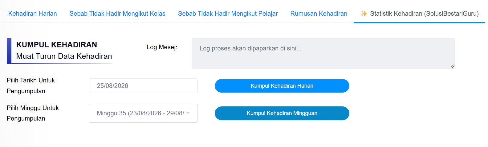

- Guru PKHEM 👇
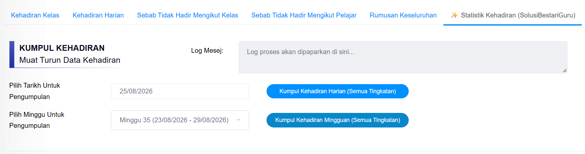

- Guru Kelas 👇
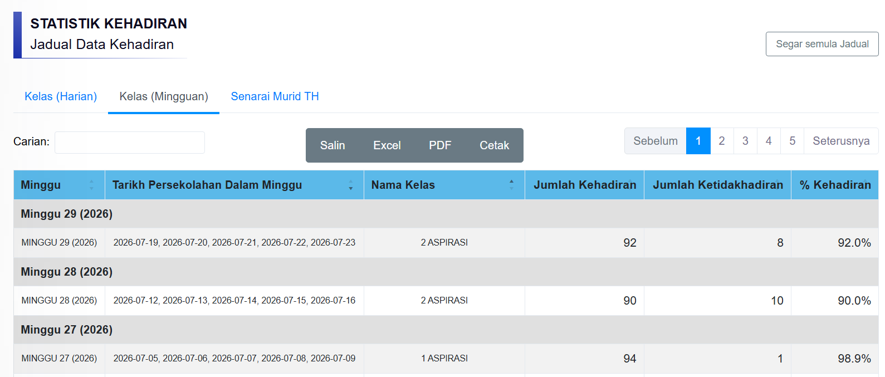

- Guru PKHEM 👇
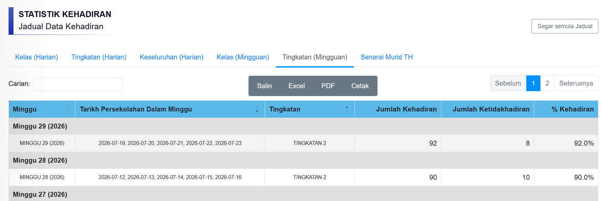

---

### 2️⃣ **Ekstrak Maklumat Profil Murid dan Penyediaan Jadual Maklumat Profil**

Fitur ini memudahkan guru mengakses dan menganalisis profil murid.

- Guru Kelas 👇
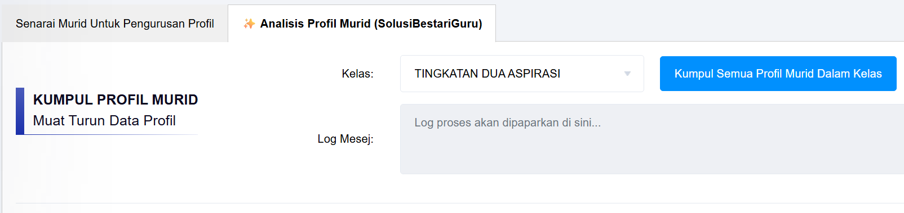

- Guru PKHEM 👇
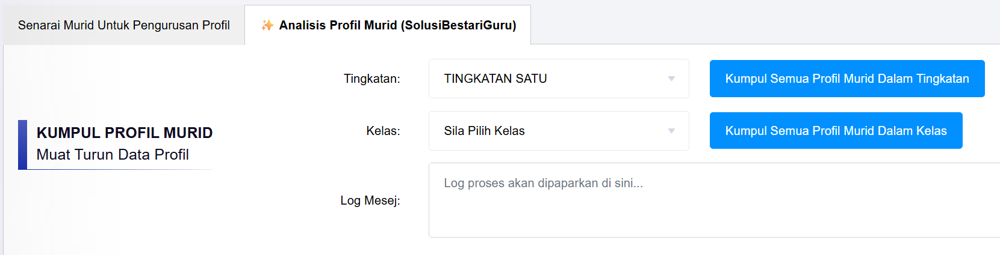

- Jadual Maklumat Profil 👇
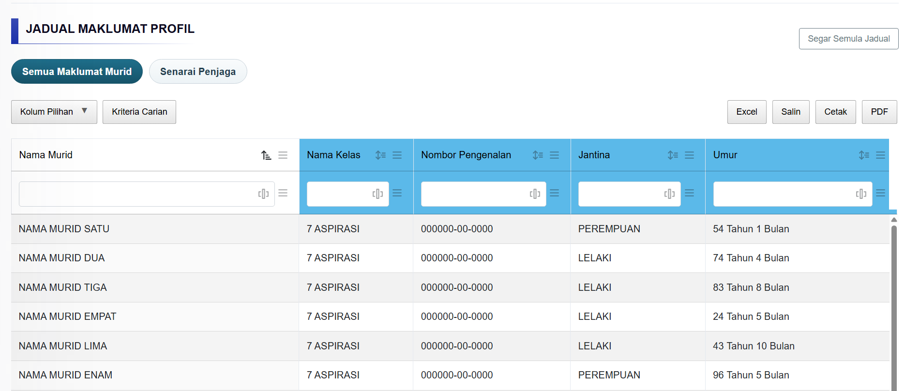

- Senarai Penjaga 👇
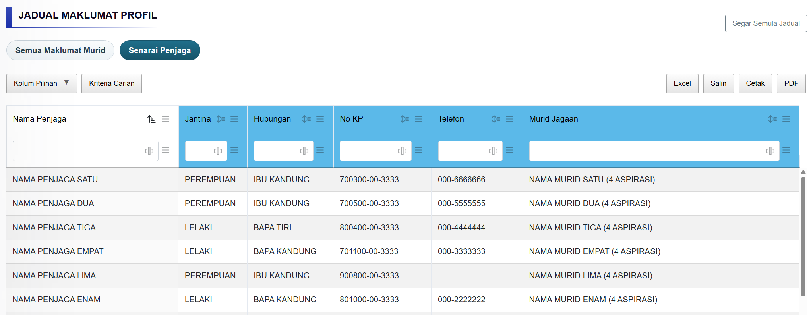

- Kolum Profil Untuk Dipilih 👇
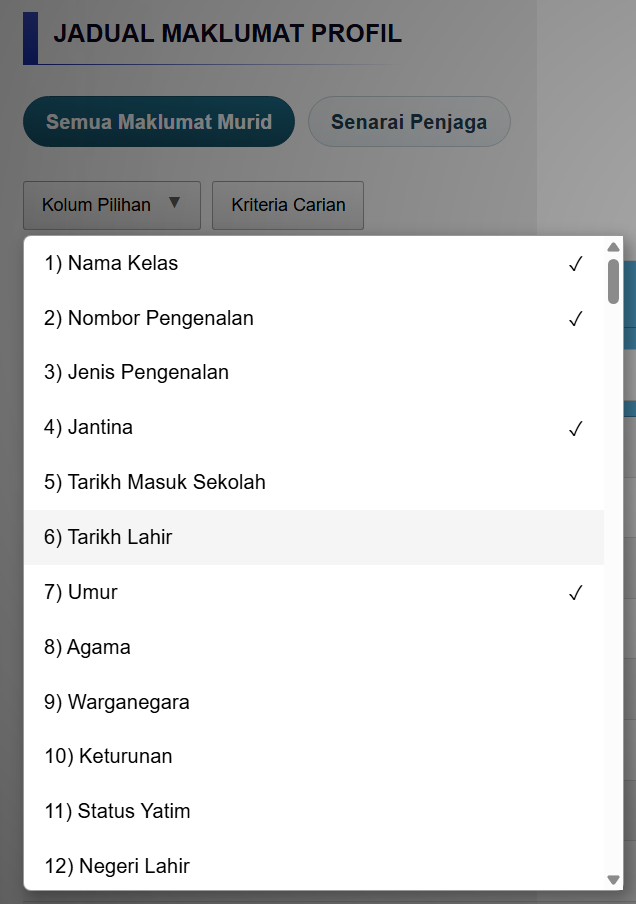
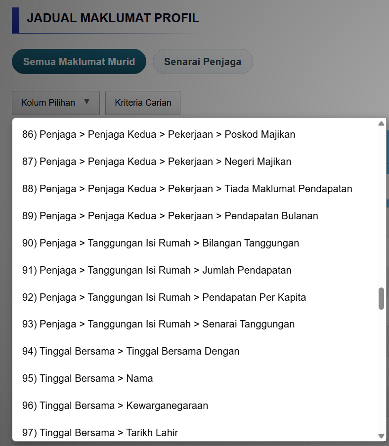

---

### 3️⃣ **Muat Turun Senarai Nama**

Fitur ini membolehkan guru memuat turun senarai nama murid yang terkini.

- Butang Muat Turun Senarai Nama 👇
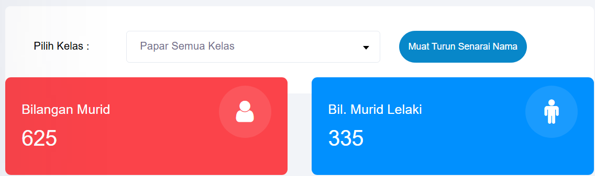

- Senarai Nama Murid Dalam Kelas Saya 👇
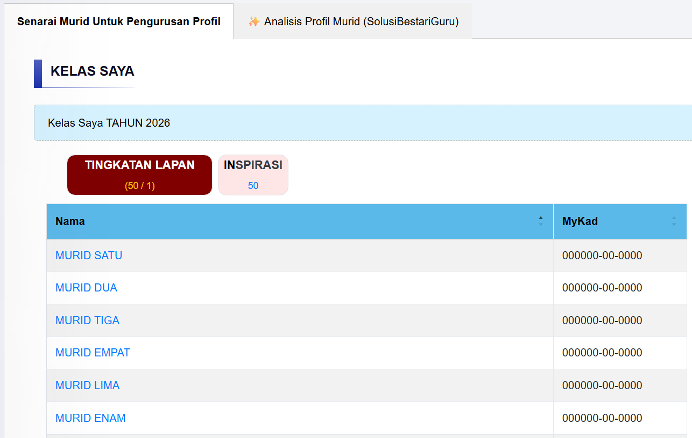

---

## 🛠️ Keperluan Sistem & Cara Pemasangan

### Keperluan Minimum

- **Pelayar Web:** Chrome, Firefox, Edge, Safari (versi terkini)
- **Sistem Pengurusan Userscript:** Tampermonkey atau Violentmonkey
- **Sambungan Internet:** Stabil untuk akses MOEISPEL
- **Akaun idMe MOEISPEL:** Akaun guru yang sah dari KPM

### Langkah Pemasangan Terperinci

#### **Langkah 1: Pasang Pengurus Userscript**

Pilih salah satu:

**Untuk Chrome/Edge:**
1. Lawati [Tampermonkey Chrome Store](https://chromewebstore.google.com/detail/tampermonkey/dhdgffkkebhmkfjojejmpbldmpobfkfo) atau [Tampermonkey Edge Add-ons](https://microsoftedge.microsoft.com/addons/detail/tampermonkey/iikmkjmpaadaobahmlepeloendndfphd)
2. Klik **"Add to Chrome"** atau **"Get"**
3. Sahkan penambahan

**Untuk Firefox:**
1. Lawati [Tampermonkey Firefox Add-ons](https://addons.mozilla.org/firefox/addon/tampermonkey/)
2. Klik **"Add to Firefox"**
3. Sahkan penambahan

**Untuk Safari:**
1. Lawati [Tampermonkey App Store](https://apps.apple.com/us/app/tampermonkey/id6738342400?platform=mac)
2. Pasang melalui App Store

---

#### **Langkah 2: Pasang MOEISPEL–SolusiBestariGuru**

**Kaedah A: Pemasangan Automatik**

1. Klik pautan ini: [Pasang SolusiBestariGuru](https://raw.githubusercontent.com/zaimuddin/MOEISPEL-SolusiBestariGuru/main/MOEISPEL-SolusiBestariGuru.user.js)
2. Tampermonkey akan menunjukkan tetingkap pemasangan
3. Klik **"Install"** untuk mengesahkan
4. Userscript akan aktif serta-merta

**Kaedah B: Pemasangan Manual**

1. Buka [Repository GitHub](https://github.com/zaimuddin/MOEISPEL-SolusiBestariGuru)
2. Klik fail `MOEISPEL-SolusiBestariGuru.user.js`
3. Salin semua kod (Ctrl+A, Ctrl+C)
4. Di Tampermonkey, buat script baru
5. Tampal kod dan simpan
6. Tutup Tampermonkey

---

## 👥 Penyumbang & Lesen

### Maklumat Penyumbang

**Penulis Utama:**
- **Ustaz Zaimuddin Hassan**
  - 🏫 Guru Al-Quran dan Bahasa Arab
  - 🏠 SMK Padang Pak Amat, Pasir Puteh, Kelantan
  - 💬 Telegram: [@zaimuddinhassan](https://t.me/zaimuddinhassan)

---

### Lesen - Creative Commons CC0 1.0

Projek ini dilesenkan di bawah **Creative Commons CC0 1.0 Universal** (Waiver Hak Cipta Awam).

Ini bermakna:
- ✅ **Bebas Guna:** Anda boleh menggunakan kod ini untuk tujuan apa pun
- ✅ **Bebas Ubah:** Anda boleh mengubah dan menyesuaikan kod mengikut keperluan
- ✅ **Bebas Kongsi:** Anda boleh berkongsi kod dengan guru lain
- ✅ **Tiada Atribusi Wajib:** Anda tidak perlu memberikan kredit (walaupun dihargai)
- ℹ️ **Tiada Jaminan:** Kod diberikan "sebagaimana adanya" tanpa jaminan

**Teks Penuh Lesen:** Lihat fail `LICENSE` dalam repositori ini.

---

## 📞 Hubungi Kami

Hubungi **SolusiBestariGuru** melalui saluran Telegram:

### 💬 Telegram (Saluran Sokongan Rasmi)

**Bincang & Sokongan:**
- 📱 **Kumpulan Sokongan:** [@bincangsolusibestariguru](https://t.me/bincangsolusibestariguru)
- 📱 **Saluran Maklumat:** [@solusibestariguru](https://t.me/solusibestariguru)
- 📱 **Hubungi Ustaz:** [@zaimuddinhassan](https://t.me/zaimuddinhassan)

**Peraturan Kumpulan:**
- ✅ Bertanya untuk bantuan adalah digalakkan
- ⚠️ Elakkan spam atau iklan tidak berkaitan
- 🤝 Bantu guru lain jika anda tahu jawapannya

---

### 🐛 Laporan Ralat & Permintaan Fitur

**Via GitHub Issues:**
1. Lawati: https://github.com/zaimuddin/MOEISPEL-SolusiBestariGuru/issues
2. Klik **"New Issue"**
3. Pilih kategori:
   - 🐛 **Bug Report** - untuk melaporkan masalah atau ralat
   - ✨ **Feature Request** - untuk idea fitur baharu
4. Tulis perihalan secara terperinci
5. Kepilkan tangkap layar jika dapat
6. Submit issue

---

**Selamat menggunakan MOEISPEL–SolusiBestariGuru! 🎉**

*Terakhir Dikemaskini: Ogos 2026*
